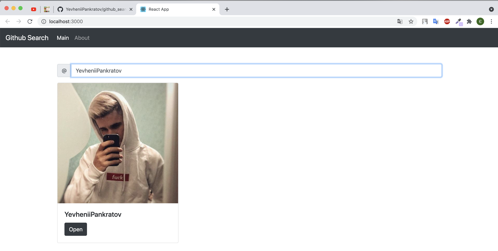

Github search react-redux app with using hooks, bootstrap, node-sass and API github

This project was bootstrapped with [Create React App](https://github.com/facebook/create-react-app).

In the project directory, you can run:

### `yarn start`

